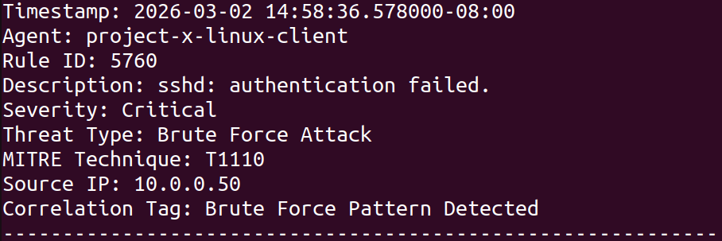

# 🔍 Automated SOC Alert Triage System
### Python-Based Wazuh SIEM Alert Enrichment & Classification Pipeline

A modular Python pipeline that automates the ingestion, parsing, enrichment, and prioritization of Wazuh SIEM alerts. Built as an extension of a hands-on SOC simulation lab, this tool reduces manual triage effort by classifying threats, mapping to MITRE ATT&CK, detecting brute-force patterns, and generating structured analyst-ready reports.

---

## 🎯 What It Does

1. **Parses** raw Wazuh SIEM alerts from JSON log output
2. **Scores** each alert by severity using Wazuh rule levels (0–15)
3. **Classifies** alerts into threat categories based on rule descriptions
4. **Maps** each threat to a MITRE ATT&CK technique ID
5. **Detects** brute-force patterns using time-window correlation across source IPs
6. **Escalates** severity for IPs flagged as brute-force attackers
7. **Generates** a structured triage report grouped by severity and technique

---

## 🗂️ Project Structure

```
soc-alert-triage/
├── main.py               # Entry point — orchestrates the full pipeline
├── parser.py             # Loads and extracts fields from Wazuh JSON alerts
├── scorer.py             # Maps Wazuh rule levels to SOC severity tiers
├── classifier.py         # Classifies alerts into threat categories
├── attack_mapping.py     # Maps threat types to MITRE ATT&CK technique IDs
├── correlator.py         # Detects brute-force patterns via time-window analysis
├── report_generator.py   # Outputs analyst-ready triage report to .txt file
└── sample_alerts.json    # Sample Wazuh alert data for testing
```

---

## ⚙️ How It Works

### Severity Scoring — `scorer.py`
Converts Wazuh rule levels (0–15) into tiered SOC severity categories:

| Wazuh Rule Level | Severity |
|---|---|
| 13 – 15 | Critical |
| 10 – 12 | High |
| 7 – 9 | Medium |
| 4 – 6 | Low |
| 0 – 3 | Informational |
| None | Unknown |

### Threat Classification — `classifier.py`
Classifies each alert based on rule description keywords:

| Keyword Match | Threat Type |
|---|---|
| `host-based anomaly detection event` | Root Check |
| `authentication failed` / `failed login` | Brute Force Attack |
| `malware` / `trojan` | Malware Infection |
| `port scan` | Reconnaissance |
| `sql injection` | Web Application Attack |
| `rootkit` | Privilege Escalation |

### MITRE ATT&CK Mapping — `attack_mapping.py`
Maps classified threat types to MITRE ATT&CK technique IDs:

| Threat Type | MITRE Technique |
|---|---|
| Brute Force Attack | T1110 |
| Malware Infection | T1204 |
| Reconnaissance | T1595 |
| Web Application Attack | T1190 |
| Privilege Escalation | T1068 |

### Brute Force Correlation — `correlator.py`
Detects brute-force attacks using time-window analysis:
- Groups failed login alerts (`authentication_failures`) by source IP
- Flags any IP with **5 or more failures within a 5-minute window**
- Returns flagged IPs, which triggers a **severity escalation to Critical** in the main pipeline

### Report Output — `report_generator.py`
Writes a structured `triage_report.txt` with the following fields per alert:

```
Timestamp | Agent | Rule ID | Description | Severity
Threat Type | MITRE Technique | Source IP | Correlation Tag
```

---

## 🚀 Usage

### Requirements
- Python 3.x
- No external libraries required (standard library only)

### Run
```bash
python main.py
```
Make sure `sample_alerts.json` is in the same directory. Each line should be a valid Wazuh alert in JSON format.

### Output
A `triage_report.txt` file will be generated in the working directory.

---

## 📸 Sample Output

The following shows a triaged alert after passing through the pipeline:



> Severity escalated to Critical, threat type classified as Brute Force Attack, MITRE technique mapped to T1110, and brute force correlation pattern detected.

---

## 🗺️ MITRE ATT&CK Coverage

`T1110` `T1204` `T1595` `T1190` `T1068`

---

## 🔍 Skills Demonstrated

- **Python** — modular pipeline design, JSON parsing, datetime handling
- **Log Analysis** — Wazuh alert structure, rule levels, rule groups
- **Threat Detection** — keyword-based classification, time-window correlation
- **MITRE ATT&CK** — automated technique mapping from alert metadata
- **SOC Workflows** — severity triage, alert enrichment, analyst report generation

---

## 🔗 Related Project

This tool was built as an extension of:
👉 [Virtualized Enterprise Security Lab](https://github.com/hsuehbruce52717/Virtualized-Enterprise-Security-Lab) — the SOC home lab where Wazuh alerts were generated

---

## 📌 Notes

- Sample alert data (`sample_alerts.json`) is required to run the pipeline
- No real credentials or sensitive data are included
